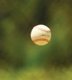
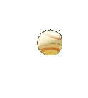
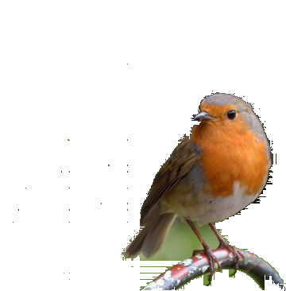
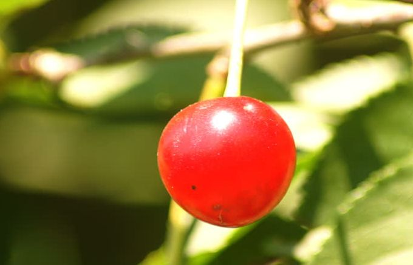
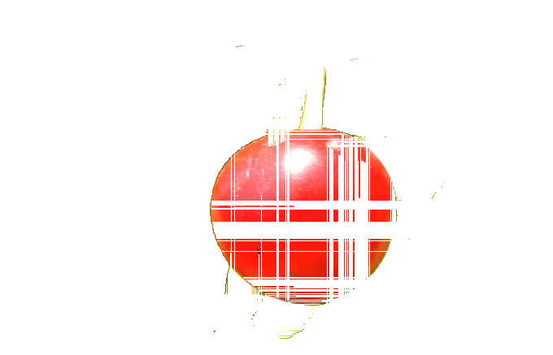
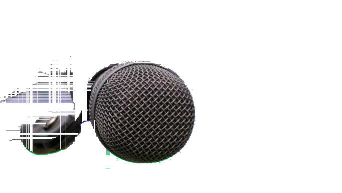
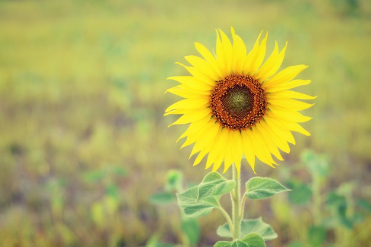
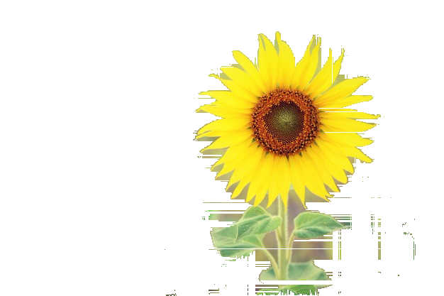
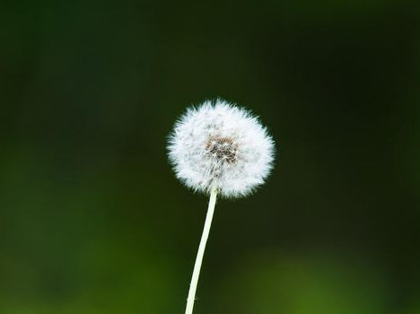

Detect single objects in small, background-blurred and close-focused images.<br /><br />
NPM link: [object-detection](https://www.npmjs.com/package/object-detection)
# Installation
`npm install object-detection`
# Usage
```

var detectObject = require('object-detection')

// Tweak the Sensitivity and the Tolerance for optimal result

var config = {
  imageName: 'path-to-image', // preferrably less than 100 kB
  fileExt: 'jpg', // preferrably jpg
  sensitivity: 50, // ranges from 1 to 100
  tolerance: 50, // ranges from 1 to 100
}

detectObject(config).then(function(response) {
  var base64Img = response.base64Img
  // use base64Img ...
  imageElement.setAttribute('src', 'data:image/' + config.fileExt + ';base64,' + base64Img);
})

```
# Caution
- Use small images, preferably less than 100 kB
- Currently works for single object.
- Behaviour is not strongly defined for multi-objects.
- Contiguous objects are considered as single object.
- Optimizer is not well tuned yet.
# Web console
[object-detection-console](https://github.com/rosesonfire/objectDetectionConsole) is a simple web console for the object-detection package.
# Examples
Name|Image|Object|Sensitivity|Tolerance
-|-|-|-|-
Baseball|||87|50
Birb|||94|57
Cherry|||86|21
Mic|||87|20
Sunflower|||94|22
Flower|||80|17