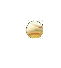
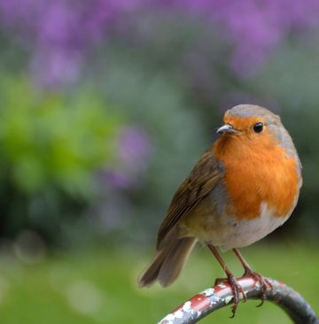
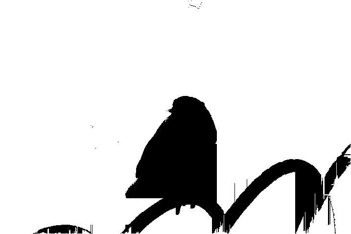
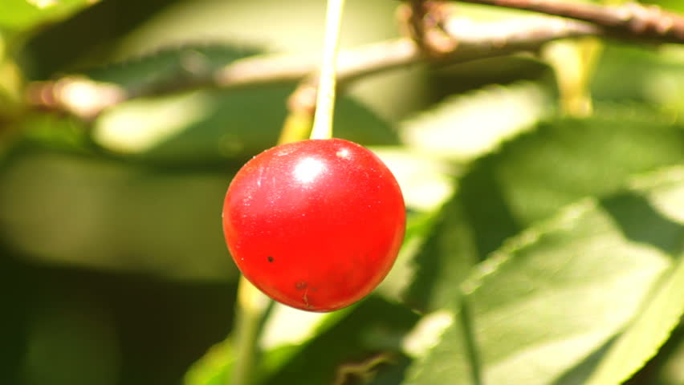
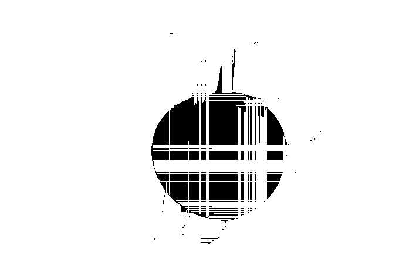
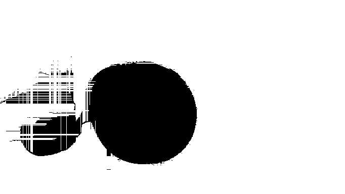
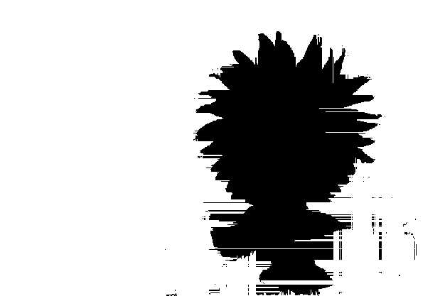

Detect objects in small, background-blurred and close-focused images
# Installation
`npm install`
# Caution
- Use small images, preferably less than 100 kB
- Currently works for single object.
- Behaviour is not strongly defined for multi-objects.
- Contiguous objects are considered as single object.
- Optimizer is not well tuned yet.
# Start
`npm start`
# Examples

Name|Image|Object
-|-|-
Baseball||
Birb||
Cherry||
Mic||
Sunflower||
Flower||