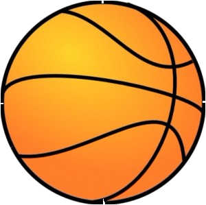

Detect objects in small background blurred and close focused images
# Installation
`npm install`
# Caution
- Use small images, preferably less than 100 kB
- Currently works for single object.
- Behaviour is not strongly defined for multi-objects.
- Contiguous objects are considered as single object.
- Optimizer is not well tuned yet.
# Start
`npm start`
# Examples
- Ball 

- Bird 

- Birb 

- Cherry 

- Mic 

- Sunflower 

